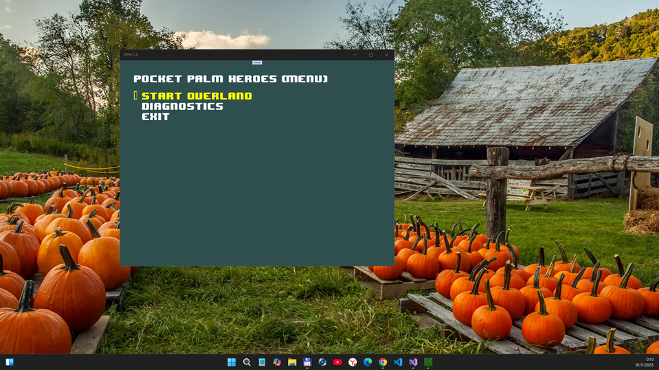

# PPH (Pocket Palm Heroes) v1.0-pre-pre-pre-alpha - dev branch

My fork of PPH-Native project for some micro-RnD

## Screenshots

## Design

## Status
- Init phase of Windows Mobile - Windows Phone (UWP) porting

## Where are we now

# Stages +
1) Базовый каркас
- Создать C# `ViewManager` и интерфейсы `IGame`, `IView`.
- Включить цикл `Update/Draw` и роутинг ввода к активной вьюшке.
- Заглушки: Menu/Overland/Battle с минимальной отрисовкой.

2) Контент и ресурсы =-
- Переименовать `pheroes\\bin` → `AssetsRaw`/`ContentRaw`.
- Описать импортёр/конвертер для графики/звука (по возможности XNB), временно — прямые загрузчики файлов из `AssetsRaw`.

3) Игровая логика =-
- Перенести `iGame.MainMenu/StartNewGame/ExitGame/Process` в C# стейт-машину.
- Перенести обработчики ввода (`OnKeyDown/OnKeyUp`) и таймерные события.
- Поднять базовый оверленд (карта, скролл, выделение) без боя.

4) UI и взаимодействия -
- Портировать `iPopupView`, диалоги, тултипы.
- Текст/шрифты: заменить `iDibFont` на `SpriteFont` и/или отрисовку bitmap-фонтами.

5) Бой и AI -
- Перенести боевой экран, инициативу, действия, эффекты.
- Восстановить базовый AI передвижений/решений.

6) Сохранения и совместимость -
- Формат сейвов: определить совместимость/миграцию.
- Настроить пути данных UWP и разрешения.

7) Тестирование и полировка -
- Модульные проверки ключевых систем (ввод/рендер/звук).
- Валидация производительности и корректности логики.

## Main current problem
- Game Cache (LocalStorage - LocalState - Cache) is empty (no unpacked maps, etc.)

## Credits

This work contains the following code:

* Pocket Heroes Game, Apache 2.0 License
* libxml2, MIT License

Also, there are the following dependencies in the `externals` dir:

* Windows Template Library, Microsoft Public License
* LZ👌 (lzokay), MIT License
* libpng and zlib, zlib License

## References
- https://github.com/SerVB/pph-native PPH by SerVB
- https://www.palmheroes.com/ Old Palm Heroes site

## .

As is. No support. RnD only.

## ..

[m][e] Nov, 2 2025

