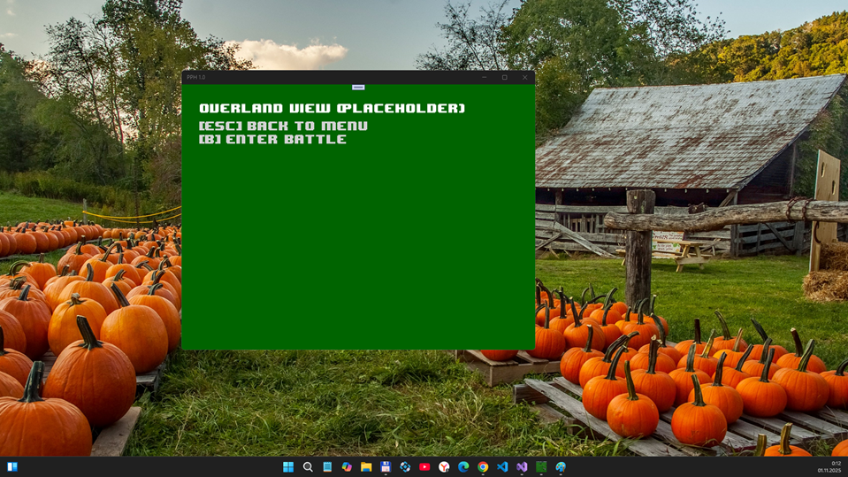

# PPH (Pocket Palm Heroes) v1.0-pre-pre-pre-alpha - dev branch

My fork of PPH-Native project for some micro-RnD

## Screenshots

## Status
- Init phase of Windows Mobile - Windows Phone (UWP) porting
- Full /Data folder (row files for maps, tiles, sprites, sound effects, etc.)

## Credits

This work contains the following code:

* Pocket Heroes Game, Apache 2.0 License
* libxml2, MIT License

Also, there are the following dependencies in the `externals` dir:

* Windows Template Library, Microsoft Public License
* LZ👌 (lzokay), MIT License
* libpng and zlib, zlib License

## References
- https://github.com/SerVB/pph-native PPH by SerVB
- https://www.palmheroes.com/ Old Palm Heroes site

## .

As is. No support. RnD only.

## ..

[m][e] Nov, 2 2025

